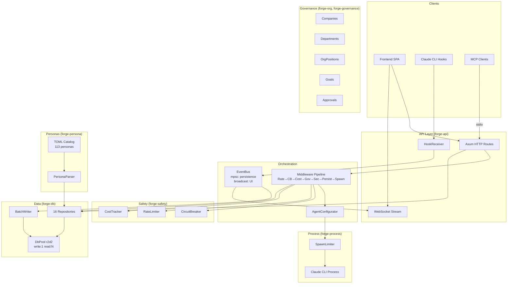

# Agent R4-A: Architecture Diagram Refresh + Remaining Docs

> Redraw the architecture Mermaid diagram to reflect current state (governance layer, hook receiver, configurator). Document persona pipeline. Update crate descriptions.

## Step 1: Read Context

- `CLAUDE.md`
- `site-docs/architecture/overview.md` — current Mermaid diagram (stale, Wave 2 era)
- `site-docs/architecture/crates.md` — crate descriptions
- `site-docs/reference/personas.md` — current persona docs
- `crates/forge-api/src/routes/mod.rs` — all route modules (for architecture accuracy)
- `crates/forge-api/src/routes/run.rs` — middleware chain (for architecture accuracy)
- `crates/forge-api/src/configurator.rs` — AgentConfigurator (Wave 4 addition)
- `crates/forge-api/src/routes/hooks.rs` — HookReceiver endpoints
- `crates/forge-persona/src/parser.rs` — persona loading pipeline
- `crates/forge-app/src/main.rs` — see seed_personas() function for pipeline

## Step 2: Redraw Architecture Diagram

Replace the Mermaid diagram in `site-docs/architecture/overview.md` with one that includes:

1. **Clients layer:** Frontend SPA, Claude CLI (via hooks), MCP clients (stdio)
2. **API layer:** Axum HTTP routes, WebSocket, HookReceiver endpoints
3. **Orchestration layer:** AgentConfigurator, Middleware chain (7 stages), EventBus (fan-out)
4. **Core services:** forge-safety (CircuitBreaker, RateLimiter, CostTracker), forge-process (SpawnLimiter)
5. **Data layer:** DbPool (r2d2 read/write), BatchWriter, 16 repos
6. **Governance layer:** Companies, Departments, OrgPositions, Goals, Approvals
7. **Persona layer:** TOML catalog → PersonaParser → DB seed → API serve → Hire flow

Example structure:


Adjust the diagram to match what you find in the actual code. Add a `<!-- Last updated: 2026-03-15 -->` comment.

## Step 3: Update Crate Descriptions

In `site-docs/architecture/crates.md`, update descriptions to reflect Wave R2 changes:

- **forge-core:** EventBus now has fan-out (mpsc + broadcast), 43 ForgeEvent variants
- **forge-db:** r2d2 connection pool (write:1, read:N), busy_timeout=5000, SafetyRepo for persistent state
- **forge-safety:** CircuitBreaker with persistence (export/restore), SpawnLimiter for concurrency control
- **forge-process:** SpawnLimiter (Semaphore-based), max_concurrent + max_output_bytes

## Step 4: Document Persona Pipeline

In `site-docs/reference/personas.md`, ensure the pipeline is accurately documented:

1. TOML files in `personas/` directory (source of truth)
2. `PersonaParser::parse_all()` reads all `.toml` files
3. Divisions extracted from `division_slug` fields, auto-capitalized
4. `persona_repo.upsert_divisions()` + `persona_repo.upsert_personas()` on startup
5. Served via `GET /api/v1/personas` (list) and `GET /api/v1/personas/:id` (detail)
6. Hired via `POST /api/v1/personas/:id` → creates Agent + OrgPosition

Read `crates/forge-app/src/main.rs` `seed_personas()` function to verify this flow.

## Step 5: Verify

```bash
cd /Users/bm/cod/trend/10-march/agentforge-hq && mkdocs build --strict 2>&1 | tail -5
```

## Rules

- Touch ONLY files under `site-docs/`
- Do NOT modify any Rust code, frontend code, or root-level docs
- Do NOT duplicate information that's in CLAUDE.md — reference it instead
- Verify all numbers from actual source code, not from existing docs

## Report

When done, create `docs/agents/REPORT_R4A.md`:

```
STATUS: COMPLETE | PARTIAL | BLOCKED
FILES_MODIFIED: [list]
DIAGRAM_UPDATED: yes/no
CRATE_DESCRIPTIONS_UPDATED: [count]
PERSONA_PIPELINE_DOCUMENTED: yes/no
MKDOCS_BUILD: pass/fail
```
