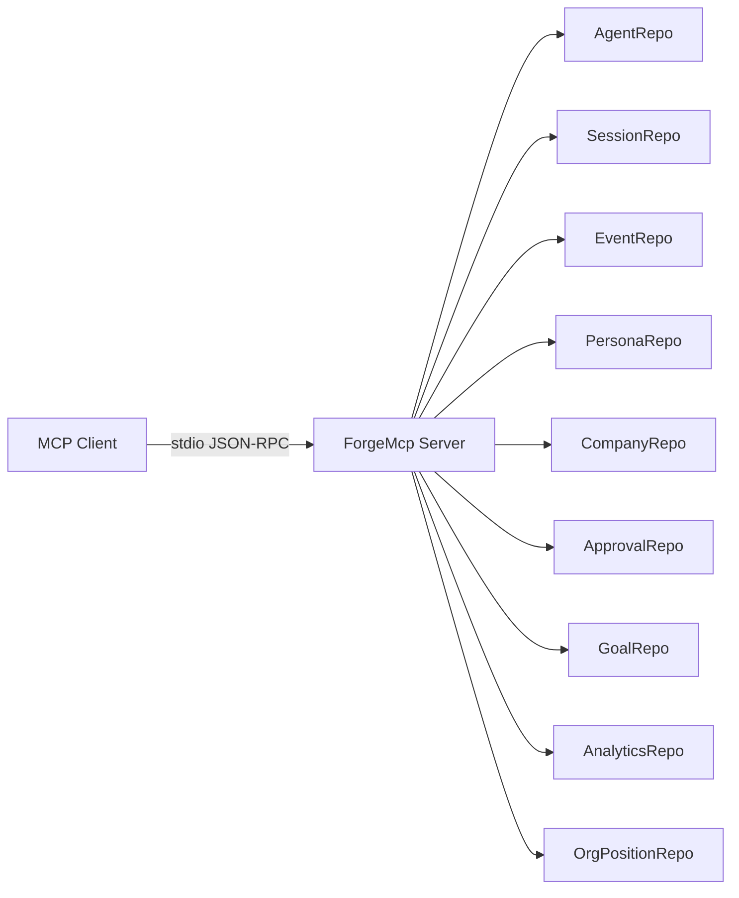

# MCP Server

AgentForge exposes 19 MCP tools via stdio transport using rmcp v0.17.

## Usage

### As Claude Code MCP server

Add to your `.claude/mcp.json`:

```json
{
  "mcpServers": {
    "agentforge": {
      "command": "/path/to/forge-mcp",
      "env": {
        "FORGE_DB_PATH": "~/.agentforge/forge.db"
      }
    }
  }
}
```

### Standalone

```bash
FORGE_DB_PATH=~/.agentforge/forge.db forge-mcp
```

The server communicates over stdio using JSON-RPC (MCP protocol).

## Architecture



All repos share the same SQLite database as the main forge binary, so MCP tools see the same data as the web UI.

## Tool Categories

See [MCP Tools Reference](../reference/mcp-tools.md) for the full list.

| Category | Tools | Purpose |
|----------|-------|---------|
| Workforce | 7 | Agent CRUD, persona listing, hiring |
| Sessions | 4 | Session CRUD, export, events |
| Governance | 4 | Approvals, budget, goals |
| Intelligence | 1 | Task classification |
| Observability | 1 | Analytics |

## Transport

Currently stdio only. HTTP SSE transport is planned but deferred — rmcp v0.17 doesn't yet support it.
