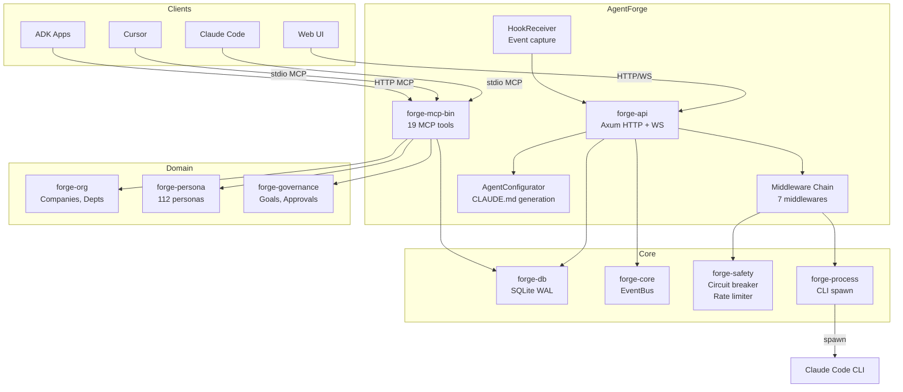

# Architecture Overview

AgentForge is a Rust workspace with 13 crates, compiled into a single binary that serves both the API and the embedded Svelte frontend.

## High-Level Architecture

## Design Principles

1. **Single binary** — no runtime dependencies, no Docker required
2. **SQLite WAL** — concurrent reads, single-file database, zero config
3. **Embedded frontend** — Svelte build files compiled into the binary via rust-embed
4. **Event-driven** — 38 ForgeEvent variants broadcast through EventBus
5. **Middleware chain** — composable pipeline for run execution
6. **MCP-first** — 19 tools accessible from any MCP client
7. **Configure, don't inject** — AgentConfigurator writes CLAUDE.md per persona instead of middleware injection
