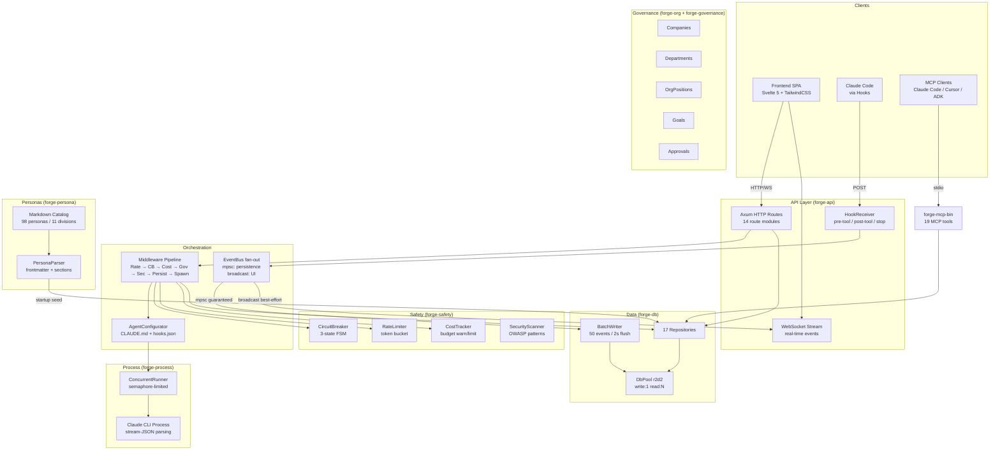

# Architecture Overview

<!-- Last updated: 2026-03-15 -->

AgentForge is a Rust workspace with 13 crates, compiled into a single binary that serves both the API and the embedded Svelte frontend.

## High-Level Architecture

## Design Principles

1. **Single binary** — no runtime dependencies, no Docker required
2. **SQLite WAL** — concurrent reads, single-file database, zero config
3. **Embedded frontend** — Svelte build files compiled into the binary via rust-embed
4. **Event-driven** — 43 ForgeEvent variants fanned out through EventBus (mpsc for persistence, broadcast for UI)
5. **Middleware chain** — 7-stage composable pipeline for run execution
6. **MCP-first** — 19 tools accessible from any MCP client
7. **Configure, don't inject** — AgentConfigurator writes CLAUDE.md + hooks.json per persona instead of middleware injection

## Request Flow

A typical `POST /api/v1/run` request passes through:

1. **RateLimitMiddleware** — token bucket check
2. **CircuitBreakerMiddleware** — fail-fast if circuit is open
3. **CostCheckMiddleware** — budget enforcement
4. **GovernanceMiddleware** — inject company context, goals, pending approvals
5. **SecurityScanMiddleware** — OWASP pattern scanning on output
6. **PersistMiddleware** — set session to running, emit lifecycle events
7. **SpawnMiddleware** — AgentConfigurator writes workspace files, then spawns Claude CLI

## Hook Receiver Flow

Claude Code instances report back to AgentForge via HTTP hooks:

1. **PreToolUse** → `POST /api/v1/hooks/pre-tool` — gate tool usage (currently allow-all)
2. **PostToolUse** → `POST /api/v1/hooks/post-tool` — security scan on tool output
3. **Stop** → `POST /api/v1/hooks/stop` — mark session completed
